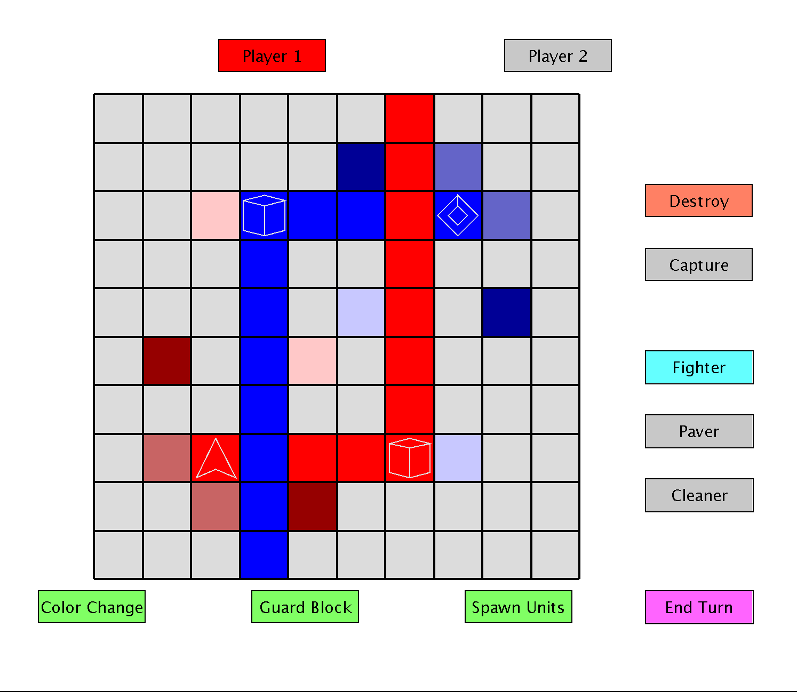

  
  
  

OthelloWar is played out on a 2-D grid with a turn-by-turn format. Each team can do four things in one turn: Create units, move/use units, move 'guard blocks', and perform a color change. When a colored block is placed on the grid, if there exists the same colored block in the same row or column, all blocks in between the two are changed to that color. The objective is to move units next to an opposing team's objective blocks and either capture or destroy them. When all of a teams objective blocks are taken away, that team loses. The last team with an obective block in their control wins.

The project started off as me wondering what I could do with Dylan Kobayashi's Java E.Z graphics. I wanted to practice developing the logic of a program separate from the visuals, and was interested in what I could accomplish after a year-and-a-half of programming. After writing down what the rules of game, I started coding the logic. I didn't have a solid plan, and as a result I was constantly making changes. After taking the time to think about the overall structure, I was able to develop code much more quickly. The color change mechanic was the most complex part to figure out and it involved the use of a few data structures. I still didn't know where the whole game would come together and how I would connect it to E.Z graphics.

After finishing the logic I started to work on the graphics. To my suprise, I ended up needing a graphics class counterpart for every logic class. This was the only way I could think of to pass down the information to keep the visuals consistant with the logic. Trying to implement a GUI that worked primarily with the mouse took a lot more than I expected, and was one of the more difficult parts of the project. I had planned on making a title screen and letting the user choose what map they want to play on via the GUI. However, I got tired of working on this project and didn't think it was worth the effort.

Overall there were several unexpected problems that required changes in multiple classes that could have been avoided with extensive and proper planning. It gave me an appreciation for the work and attention to detail that goes into making a GUI. I think the game itself is terribly unbalanced at times, or can easily result in stalemates. I've only ever played it against myself though, so I don't know what others would think of it.

You can find and download the source code [here](https://github.com/zach2heth/OthelloWar).

