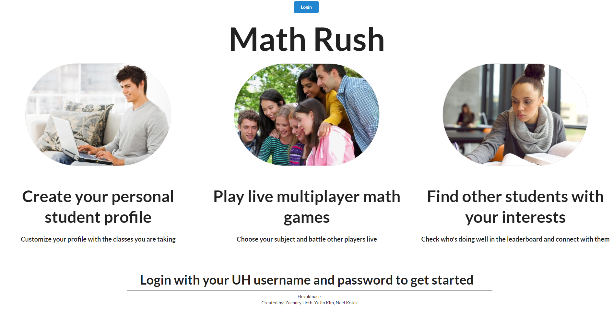

This was the final group project in ICS 314, Software Engineering.

<h3>Goal</h3>
The assignment was to create a website that solves some problem, or benefits students at the University of Hawaii at Manoa. The goal of Math Rush was to create a website which lets users create accounts and play math games relevant to their current math courses. Their scores would be saved and put on a leaderboard for others to see. Some games would be multiplayer, allowing students to play against one another.
<h3>Development & Contributions</h3>

The other members for this project were [Neel Kotak](https://neelkotak13.github.io/) and [Yujin Kim](https://yjkim97.github.io/). We used [Bowfolios](https://bowfolios.github.io/) as are starting code base, which uses [Meteor](https://www.meteor.com/). It being hosted online through Meteor Galaxy

I helped create the html and templates for the [Game-Types page](http://mathrush.meteorapp.com/gametypes), [Profile page](http://mathrush.meteorapp.com/userprofile), and the game[http://mathrush.meteorapp.com/game1] itself. I was not able to complete the game in time for this project's deadline. It has some functionality when ran locally on my computer, but we were not able to see that when it was deployed to galaxy.

<h3>What I learned</h3>

Even though the final product does not have much functionality, I was able to learn a lot from doing this project. This was my first time using several features of Git and GitHub. I have a better understanding of branches, and how they allow multiple people to work on the same code base at once. Working on creating the game forced me to learn a lot about Meteor, and what is possible using templates. I see how Javascript and Html from different files can be used together.

[Learn more about the Math Rush](https://hexokinase.github.io/).
[Source code](https://github.com/hexokinase/math-rush).
